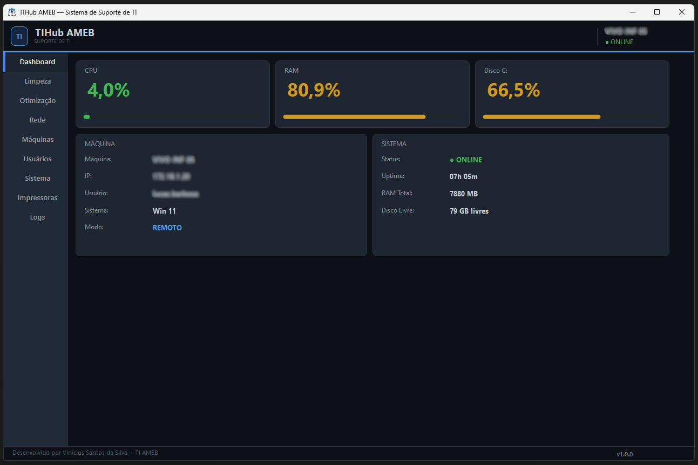
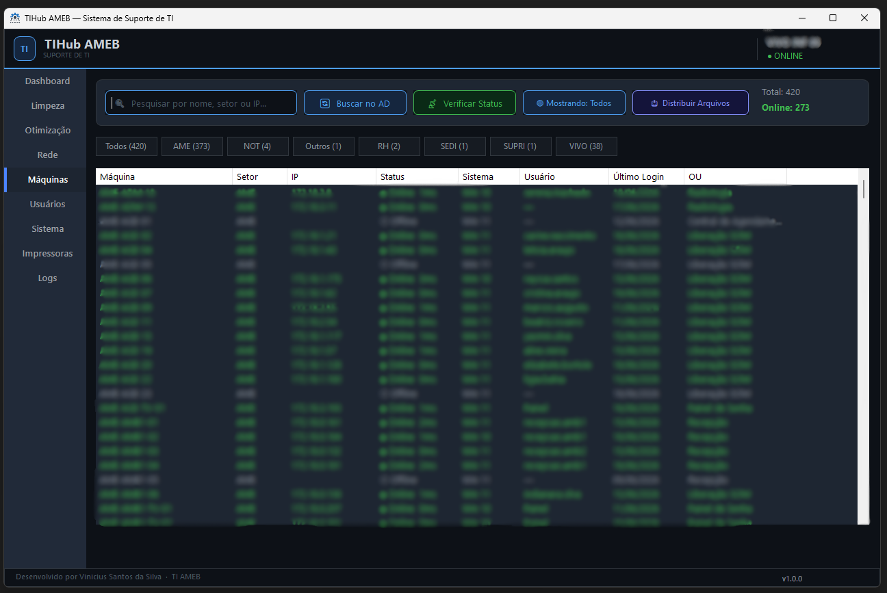
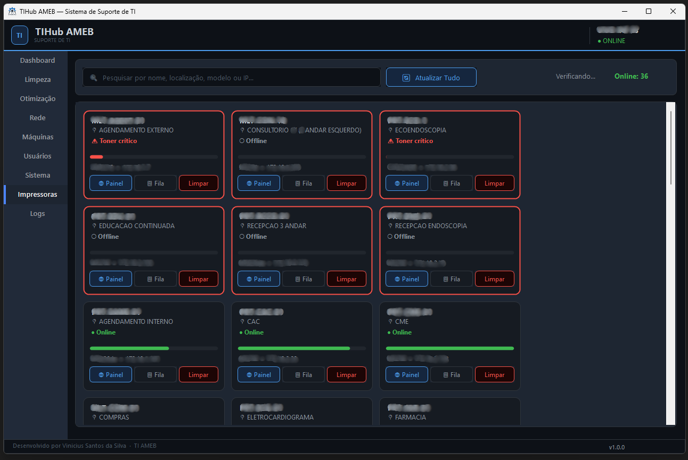
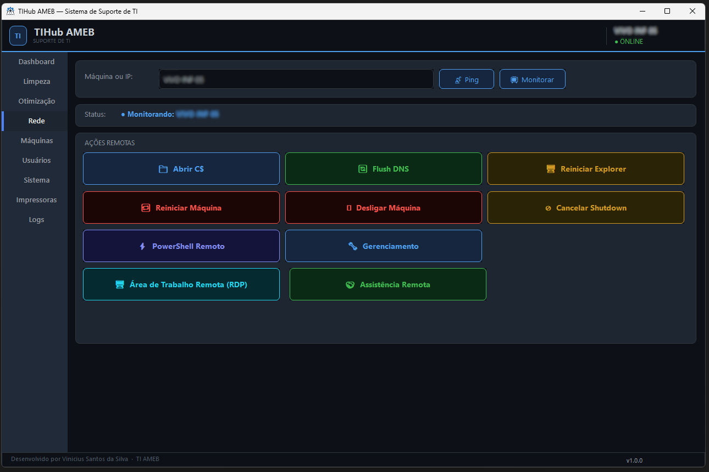
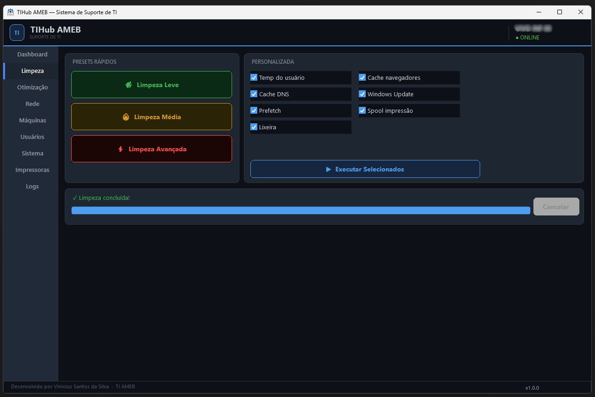
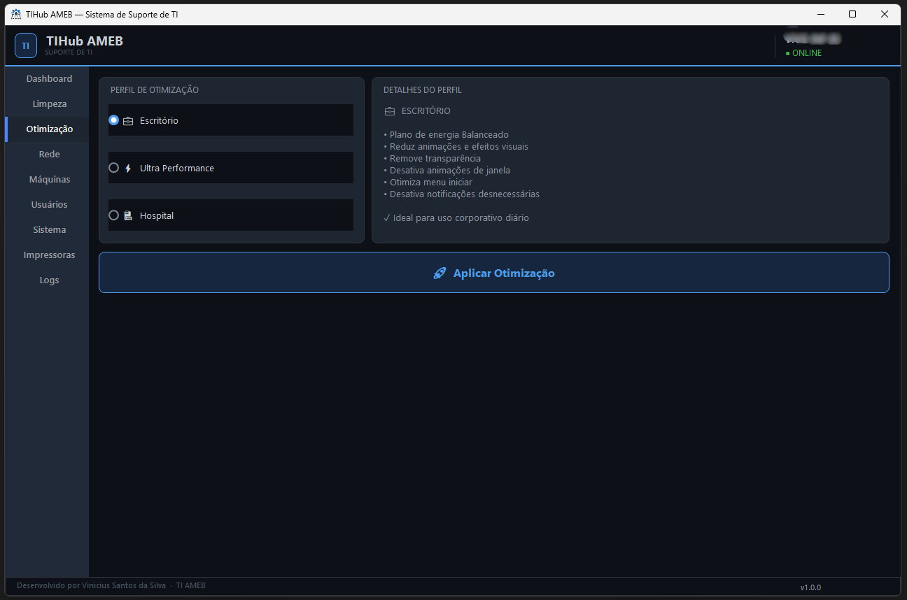
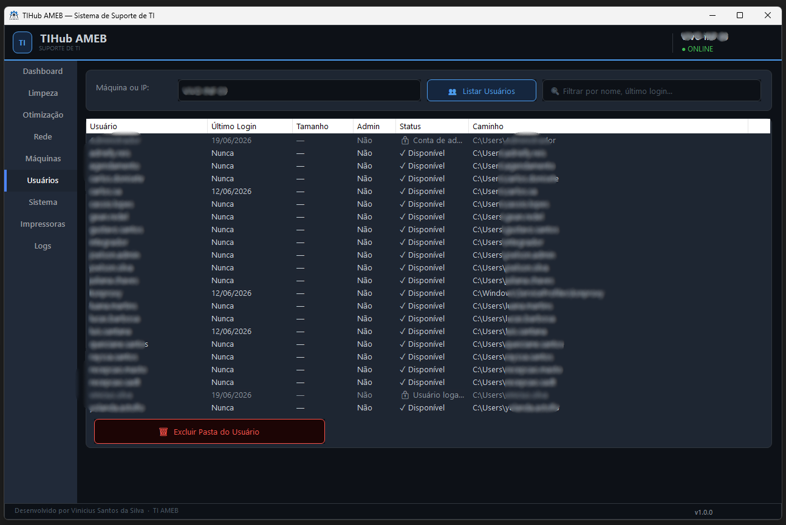
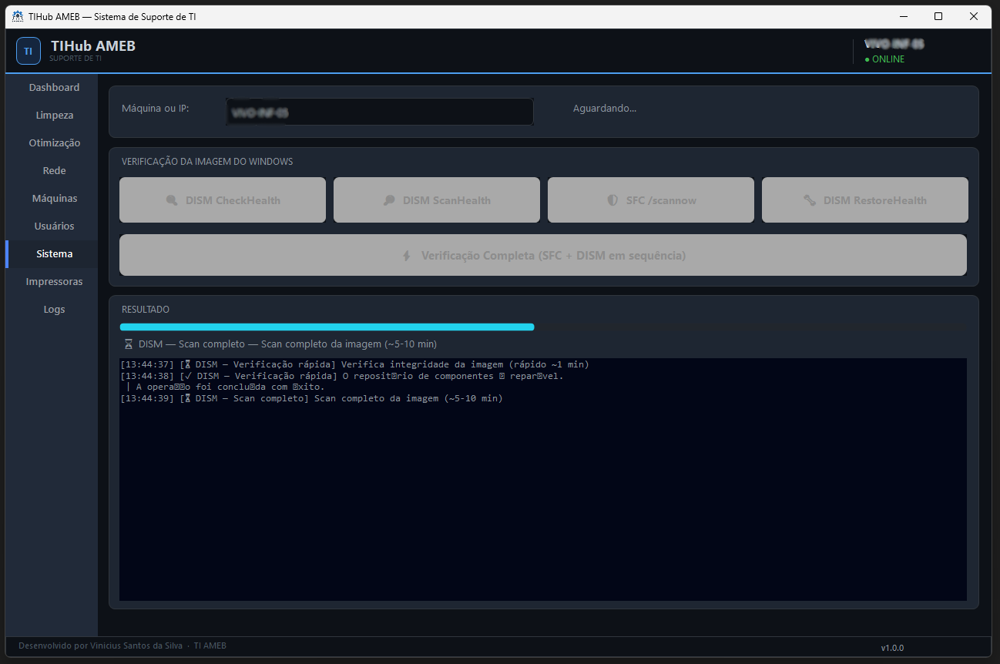
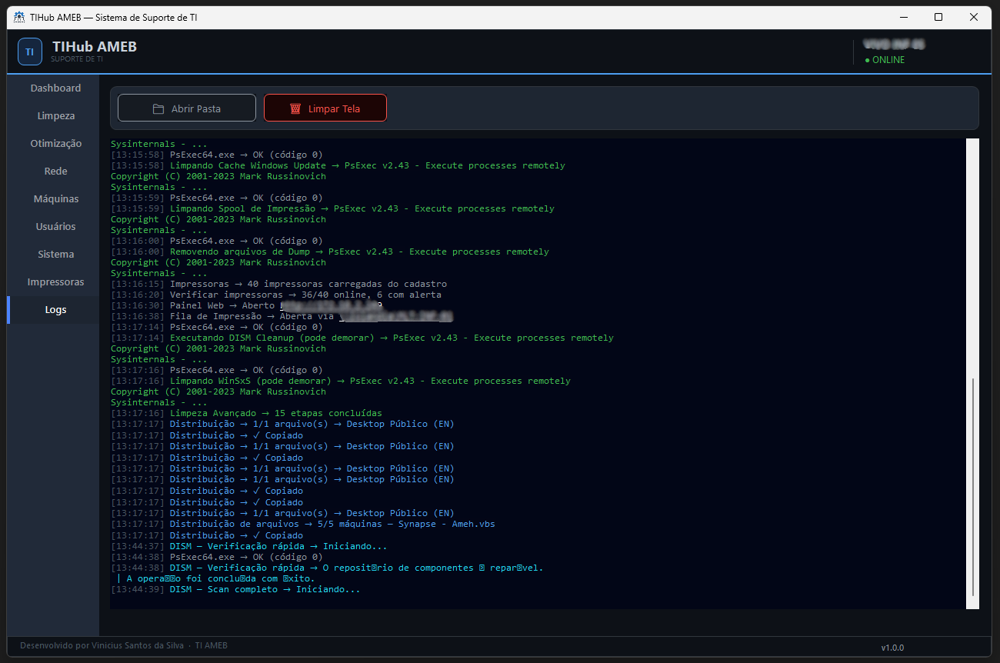

# TIHub AMEB

> Sistema desktop de suporte e gestão de TI para ambiente hospitalar — C# / WinForms / .NET 10

Desenvolvido pela equipe de TI, o TIHub centraliza em uma única interface as tarefas mais comuns do dia a dia: monitoramento remoto de máquinas, limpeza e otimização do Windows, ações remotas via rede, diagnóstico de integridade do sistema, painel de impressoras com nível de toner em tempo real, distribuição de arquivos em massa e um diretório completo de estações integrado ao Active Directory.

> ⚠️ **Aviso de segurança**: este sistema executa ações administrativas remotas (PSExec, WMI, alterações de registro) em máquinas de domínio. Leia a seção [Segurança e Riscos](#segurança-e-riscos) antes de usar em produção.

---

## Capturas de tela

### Dashboard — monitoramento em tempo real

*CPU, RAM, Disco e informações completas da máquina monitorada remotamente via WMI*

### Aba Máquinas — diretório do Active Directory

*420 máquinas cadastradas, 280 online, com usuário conectado e filtros por setor*

### Aba Impressoras — painel visual com nível de toner

*Cards com alertas visuais para impressoras com toner crítico ou offline*

### Aba Rede — ações remotas

*RDP, Assistência Remota, PSExec, Flush DNS, reiniciar e desligar com um clique*

### Aba Limpeza

*Presets rápidos e modo personalizado com barra de progresso em tempo real*

### Aba Otimização

*Três perfis: Escritório, Ultra Performance e Hospital (conservador)*

### Aba Usuários

*Listagem de perfis remotos com campo de busca e exclusão protegida*

### Aba Sistema

*SFC e DISM (CheckHealth, ScanHealth, RestoreHealth) com resultado em tempo real*

### Aba Logs

*Histórico colorido de todas as ações com persistência em arquivo diário*

---

## Funcionalidades

| Aba | Descrição |
|-----|-----------|
| **Dashboard** | Monitoramento em tempo real de CPU, RAM, disco, uptime e usuário logado — local ou remoto via WMI. Atualiza a cada 5 segundos sem travar a interface. |
| **Limpeza** | Presets (Leve / Médio / Avançado) e modo personalizado. Limpeza de temp, cache, prefetch, lixeira, DNS, navegadores, Windows Update, spool e dumps via PowerShell. |
| **Otimização** | Três perfis de ajuste de performance. Aplica alterações corretamente no perfil do usuário logado via HKEY_USERS\{SID}, não no perfil do SYSTEM. |
| **Rede** | Ping, monitoramento contínuo, compartilhamento C$, flush de DNS, reiniciar Explorer, reiniciar/desligar, PowerShell remoto, RDP e Assistência Remota. |
| **Máquinas** | Diretório completo do Active Directory, filtro em tempo real por qualquer coluna, filtro por setor e Online/Offline. Servidores excluídos automaticamente pelo atributo operatingSystem do AD. |
| **Impressoras** | Painel com cards visuais, nível de toner via SNMP (com fallback para ping), alertas automáticos para toner crítico, painel web e fila de impressão. Cadastro externo em Data/impressoras.json. |
| **Distribuição** | Copia qualquer arquivo para o Desktop Público de múltiplas máquinas via C$ em paralelo. Suporta PT e EN automaticamente. |
| **Usuários** | Lista os perfis de usuário de uma máquina (local ou remota) e permite excluir pastas de perfis inativos, com proteção contra exclusão de contas críticas. |
| **Sistema** | SFC /scannow e DISM (CheckHealth, ScanHealth, RestoreHealth) isoladamente ou em sequência completa, com log de resultado interpretado. |
| **Logs** | Histórico completo e colorido de todas as ações, com persistência em arquivo diário em %AppData%/TIHubAMEB/Logs/. |

---

## Requisitos

- Windows 10/11 (estação de TI)
- .NET 10 Desktop Runtime
- Active Directory configurado no domínio
- Conta de domínio com permissões administrativas nas máquinas-alvo
- Compartilhamento administrativo (C$) habilitado na rede
- SNMP habilitado nas impressoras (opcional — fallback para ping se indisponível)
- PsExec64.exe (Sysinternals/Microsoft) — não incluído neste repositório

---

## Instalação

### Opção 1 — Compilar do código-fonte

```bash
git clone https://github.com/SEU-USUARIO/tihub-ameb.git
cd tihub-ameb
```

Abra TIHubAMEB.sln no Visual Studio 2022+, restaure os pacotes NuGet e compile (F6).

Pacotes NuGet utilizados:

```
Guna.UI2.WinForms
System.Management
System.DirectoryServices
System.DirectoryServices.AccountManagement
SnmpSharpNet
```

### Opção 2 — Executável publicado (recomendado para distribuição)

No Visual Studio: botão direito no projeto → Publicar → Pasta → configurações avançadas:

| Configuração | Valor |
|---|---|
| Modo de implantação | Autocontido |
| Runtime de destino | win-x64 |
| Produzir arquivo único | Ativado |

O resultado fica em bin/Release/net10.0-windows/publish/win-x64/ e pode ser copiado para qualquer máquina Windows sem instalação prévia do .NET.

---

## Configuração inicial

### 1. Baixe o PsExec

Por questões de licenciamento, o PsExec64.exe não está incluído neste repositório. Baixe oficialmente em:

https://learn.microsoft.com/sysinternals/downloads/pstools

Coloque em: TIHubAMEB/Tools/PsExec64.exe

### 2. Configure o cadastro de impressoras

Copie o arquivo de exemplo e preencha com seus dados reais:

```
Data/impressoras.exemplo.json  →  Data/impressoras.json
```

O arquivo impressoras.json está no .gitignore e nunca é versionado.

Formato:

```json
[
  {
    "nome": "PRT-RECEPCAO-01",
    "ip": "192.168.1.50",
    "modelo": "MS826de",
    "localizacao": "Recepção",
    "serialNumber": "EXEMPLO0001"
  }
]
```

### 3. Execute como Administrador

O app.manifest já está configurado com requireAdministrator. Crie o atalho com Executar como administrador habilitado nas propriedades avançadas do atalho.

---

## Estrutura do projeto

```
TIHubAMEB/
├── Helpers/
│   └── UIHelper.cs                  # Paleta de cores, fontes e estilização Guna 2
├── Models/
│   ├── ConfiguracaoImpressoras.cs   # Estrutura do JSON de impressoras
│   ├── ImpressoraInfo.cs            # Dados de impressora + status SNMP
│   ├── LogEntry.cs                  # Estrutura de log
│   ├── MaquinaInfo.cs               # Dados de monitoramento (Dashboard)
│   ├── MaquinaRede.cs               # Dados de máquina do AD
│   ├── PerfilLimpeza.cs             # Configuração de limpeza
│   └── UsuarioInfo.cs               # Dados de perfil de usuário
├── Services/
│   ├── DistribuicaoService.cs       # Cópia de arquivos via C$ em paralelo
│   ├── ImpressoraService.cs         # SNMP, ping, painel web, fila
│   ├── LimpezaService.cs            # Limpeza via PowerShell
│   ├── LogService.cs                # Persistência e exibição de logs
│   ├── MaquinasService.cs           # Busca AD, ping em massa, filtros
│   ├── MonitoramentoService.cs      # Métricas via WMI (local/remoto)
│   ├── OtimizacaoService.cs         # Perfis de otimização com SID correto
│   ├── PsExecService.cs             # Execução remota via PSExec
│   ├── RedeService.cs               # Ping, RDP, Assistência Remota, shutdown
│   ├── SistemaService.cs            # SFC e DISM
│   └── UsuarioService.cs            # Listagem e exclusão de perfis
├── Data/
│   ├── impressoras.json             # NÃO versionado — dados reais locais
│   └── impressoras.exemplo.json     # Versionado — exemplo para referência
├── Tools/
│   └── PsExec64.exe                 # NÃO versionado — baixar manualmente
├── app.manifest                     # requireAdministrator
├── MainForm.cs / .Designer.cs       # Interface principal (9 abas)
└── Program.cs
```

---

## Segurança e riscos

- **Execução como SYSTEM via PSExec**: qualquer script mal configurado pode causar dano em escala na rede.
- **Exclusão de pastas de usuário**: irreversível — o sistema bloqueia contas críticas, mas não há backup automático.
- **Reinício/desligamento remoto**: pode interromper trabalho em andamento em sistemas críticos hospitalares.
- **Dados de impressoras**: IPs, nomes e localizações ficam em Data/impressoras.json, fora do repositório público.
- **Sem exclusão de e-mail/Exchange**: removido por decisão de segurança.

---

## Limitações conhecidas

- **SFC via PSExec**: exige sessão interativa para resultado completo. Recomenda-se executar localmente.
- **Assistência Remota (msra /offerRA)**: requer Política de Grupo específica. Sem ela, o sistema copia o endereço para o clipboard.
- **SNMP nas impressoras**: se não estiver habilitado, o sistema usa ping simples sem nível de toner.

---

## Roadmap

- [ ] Exportação de inventário de máquinas (CSV/Excel)
- [ ] Histórico de otimizações por máquina
- [ ] Limpeza de fila no servidor de impressão remoto
- [ ] Testes automatizados de unidade para os Services

---

## Desenvolvido por

**Vinicius Santos da Silva** — Assistente de Suporte Técnico

---

## Licença

MIT License — sinta-se livre para usar, modificar e distribuir este projeto, 
mantendo os créditos ao autor original.
